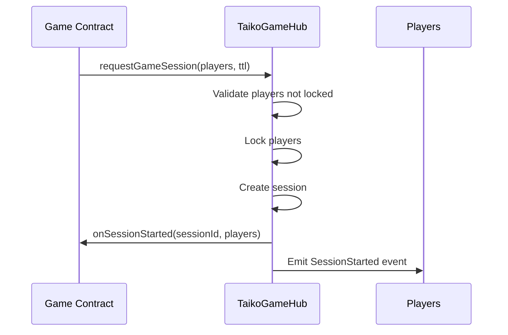
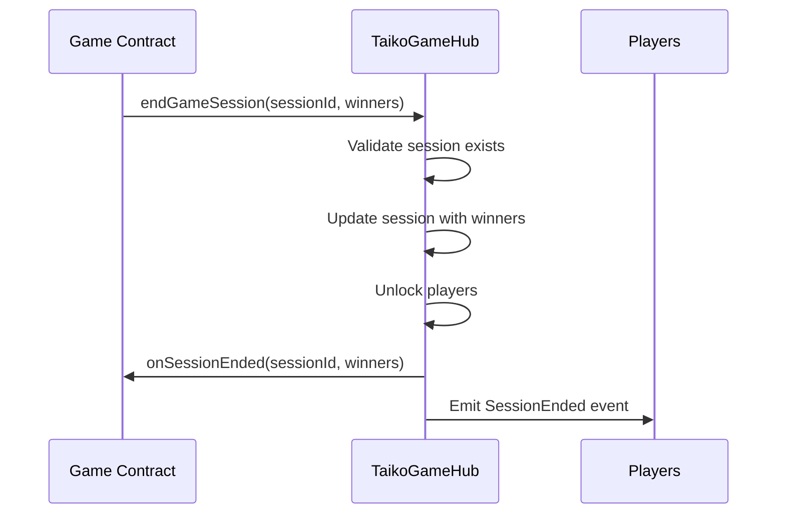

# TaikoTaikoGameHub - Taiko Gaming Ecosystem

## Overview

The TaikoTaikoGameHub is a central, upgradeable smart contract that serves as the interface for third-party games to integrate into the Taiko gaming ecosystem. It provides a comprehensive session management system with player locking, whitelisting, ranked winners, and draw support.

## Features

- **Session Management**: Create and manage game sessions with unique identifiers
- **Player Locking**: Prevent players from participating in multiple concurrent sessions
- **Whitelisting**: Only approved game contracts can create sessions
- **Ranked Winners**: Support for multiple winners in ranking order (1st, 2nd, 3rd place, etc.)
- **Draw Support**: Games can end in draws with no declared winners
- **TTL (Time-to-Live)**: Configurable session timeouts to prevent stale sessions
- **Upgradeability**: Proxy pattern implementation for future upgrades
- **Security**: Comprehensive access controls, pausability, and reentrancy protection

## Architecture

### Core Contracts

1. **TaikoTaikoGameHub.sol** - The main contract that manages all game sessions
2. **ITaikoTaikoGameHub.sol** - Interface for TaikoTaikoGameHub integration with comprehensive NatSpec documentation

### Contract Structure

```
TaikoTaikoGameHub
├── Session Management
├── Player Locking
├── Whitelist Management
├── Winner/Draw Resolution
└── Administrative Functions

BaseGame (Abstract)
├── TaikoGameHub Integration
├── Session Lifecycle Hooks
├── Metadata Management
└── Error Handling

ExampleGame (Concrete Implementation)
├── Game Logic (Rock Paper Scissors)
├── Move Submission
├── Winner Determination
└── Complete Game Flow
```

## Getting Started

### For Game Developers

#### 1. Inherit from BaseGame

```solidity
import "./BaseGame.sol";

contract MyGame is BaseGame {
    constructor(address _gameHub) BaseGame(_gameHub) {}
    
    // Implement required functions
    function gameName() external pure override returns (string memory) {
        return "My Awesome Game";
    }
    
    function gameVersion() external pure override returns (string memory) {
        return "1.0.0";
    }
    
    function minPlayers() external pure override returns (uint256) {
        return 2;
    }
    
    function maxPlayers() external pure override returns (uint256) {
        return 10;
    }
}
```

#### 2. Implement Game Logic

```solidity
function playGame(address[] calldata players) external returns (uint256 sessionId) {
    // Request a new game session
    sessionId = this.requestGameSession(players, 1 hours);
    
    // Implement your game logic here
    // ...
    
    // End the session with winners or draw
    if (hasWinners) {
        address[] memory winners = new address[](1);
        winners[0] = winnerAddress;
        this.endGameWithWinners(sessionId, winners);
    } else {
        // End as draw
        this.endGameWithDraw(sessionId);
    }
    
    return sessionId;
}
```

#### 3. Handle Session Lifecycle

```solidity
function _onGameSessionStarted(uint256 sessionId, address[] calldata players) internal override {
    // Initialize game state for the session
    gameStates[sessionId] = GameState({
        // ... initialize your game state
    });
}

function _onGameSessionEnded(uint256 sessionId, address[] memory winners) internal override {
    // Clean up game state
    delete gameStates[sessionId];
    
    // Emit events, distribute rewards, etc.
    if (winners.length > 0) {
        emit GameWon(sessionId, winners);
    } else {
        emit GameDraw(sessionId);
    }
}
```

### For TaikoGameHub Administrators

#### 1. Deploy the TaikoGameHub

```solidity
// Deploy implementation
TaikoGameHub implementation = new TaikoGameHub();

// Deploy proxy
TransparentUpgradeableProxy proxy = new TransparentUpgradeableProxy(
    address(implementation),
    admin,
    abi.encodeWithSelector(TaikoGameHub.initialize.selector, owner)
);

TaikoGameHub gameHub = TaikoGameHub(address(proxy));
```

#### 2. Whitelist Game Contracts

```solidity
// Add games to whitelist
gameHub.addToWhitelist(gameContractAddress);

// Remove from whitelist if needed
gameHub.removeFromWhitelist(gameContractAddress);
```

#### 3. Monitor and Manage

```solidity
// Check if player is locked
bool isLocked = gameHub.isPlayerLocked(playerAddress);

// Get session details
GameSession memory session = gameHub.getSession(sessionId);

// Force end expired sessions if needed
gameHub.forceEndSession(sessionId);
```

## Session Lifecycle

### 1. Session Creation



### 2. Session Execution

- Game contract implements its own logic
- Players interact with the game contract
- Game contract manages game state internally

### 3. Session Resolution



## GameSession Structure

```solidity
struct GameSession {
    uint256 sessionId;           // Unique session identifier
    address[] players;           // All participating players
    address[] winners;           // Winners in ranking order (empty for draws)
    address game;               // Game contract address
    uint256 startTime;          // Session start timestamp
    uint256 endTime;            // Session end timestamp (0 if active)
    uint256 ttl;                // Time-to-live in seconds
    bool isActive;              // Whether session is currently active
}
```

## Events

### TaikoGameHub Events

```solidity
event SessionStarted(uint256 indexed sessionId, address indexed game, address[] players, uint256 ttl);
event SessionEnded(uint256 indexed sessionId, address[] winners, bool isDraw);
event GameWhitelisted(address indexed game);
event GameRemovedFromWhitelist(address indexed game);
event SessionForceEnded(uint256 indexed sessionId, string reason);
```

### BaseGame Events

```solidity
event GameSessionRequested(uint256 indexed sessionId, address[] players);
event GameSessionEnded(uint256 indexed sessionId, address[] winners);
```

## Error Handling

### Common Errors

- `PlayerAlreadyLocked(address player)` - Player is already in an active session
- `GameNotWhitelisted(address game)` - Game contract is not approved
- `InvalidTTL(uint256 ttl)` - TTL is outside allowed range
- `SessionNotFound(uint256 sessionId)` - Session doesn't exist
- `SessionNotActive(uint256 sessionId)` - Session is not currently active
- `InvalidWinners(address[] winners)` - Winners array contains invalid addresses

## Best Practices

### For Game Developers

1. **Always validate session state** before processing game actions
2. **Implement proper error handling** for all TaikoGameHub interactions
3. **Clean up state** in `onSessionEnded` to prevent memory leaks
4. **Use appropriate TTL values** based on expected game duration
5. **Handle edge cases** like draws and player disconnections

### For Players

1. **Complete games** within the TTL period
2. **Don't attempt multiple simultaneous games** (will fail due to player locking)
3. **Monitor session events** to track game progress

### For Administrators

1. **Regularly monitor** for expired sessions
2. **Only whitelist audited** game contracts
3. **Keep upgrade mechanisms secure** with proper admin controls
4. **Monitor gas usage** and optimize if needed

## Testing

### Run Tests

```bash
# Run all TaikoGameHub tests
forge test --match-path "test/game-hub/*"

# Run specific test file
forge test --match-path "test/game-hub/TaikoGameHubSimple.t.sol"

# Run with verbose output
forge test --match-path "test/game-hub/*" -vvv
```

### Test Coverage

The test suite covers:
- Session creation and management
- Player locking/unlocking
- Whitelist management
- Winner and draw scenarios
- TTL validation and expiration
- Error conditions and edge cases
- Integration with BaseGame

## Deployment

### Prerequisites

- Foundry installed
- Private key or hardware wallet configured
- Sufficient ETH for deployment gas

### Deploy Script

```bash
# Deploy to local network
forge script script/game-hub/DeployTaikoGameHub.s.sol --rpc-url http://localhost:8545 --broadcast

# Deploy to testnet
forge script script/game-hub/DeployTaikoGameHub.s.sol --rpc-url $HEKLA_RPC_URL --broadcast --verify

# Deploy to mainnet
forge script script/game-hub/DeployTaikoGameHub.s.sol --rpc-url $MAINNET_RPC_URL --broadcast --verify
```

## API Reference

### TaikoGameHub Public Functions

#### Session Management
- `requestGameSession(address[] players, uint256 ttl) → uint256 sessionId`
- `endGameWithWinners(uint256 sessionId, address[] winners)`
- `endGameWithDraw(uint256 sessionId)`
- `forceEndSession(uint256 sessionId)`
- `getSession(uint256 sessionId) → GameSession`
- `isSessionActive(uint256 sessionId) → bool`

#### Player Management
- `isPlayerLocked(address player) → bool`
- `getPlayerCurrentSession(address player) → uint256`

#### Whitelist Management
- `addToWhitelist(address game)`
- `removeFromWhitelist(address game)`
- `isWhitelisted(address game) → bool`

#### Administrative
- `pause()` / `unpause()`
- `getContractInfo() → (string name, string version)`

### BaseGame Protected Functions

#### TaikoGameHub Integration
- `requestGameSession(address[] players, uint256 ttl) → uint256`
- `endGameWithWinners(uint256 sessionId, address[] winners)`
- `endGameWithDraw(uint256 sessionId)`

#### Lifecycle Hooks (Override Required)
- `_onGameSessionStarted(uint256 sessionId, address[] players)`
- `_onGameSessionEnded(uint256 sessionId, address[] winners)`
- `gameName() → string`
- `gameVersion() → string`  
- `minPlayers() → uint256`
- `maxPlayers() → uint256`

## Security Considerations

1. **Access Control**: Only whitelisted games can create sessions
2. **Player Locking**: Prevents double-spending of player participation
3. **Reentrancy Protection**: All external calls are protected
4. **Pausability**: Contract can be paused in emergency situations
5. **Upgradeability**: Proxy pattern allows for bug fixes and improvements
6. **Input Validation**: All parameters are validated before processing
7. **Event Emission**: Comprehensive event logging for transparency

## Documentation

### Available Documentation

- **[API Reference](./docs/API.md)** - Complete API documentation
- **[Integration Guide](./docs/INTEGRATION.md)** - Step-by-step development guide
- **[NatSpec Guide](./docs/NATSPEC.md)** - Documentation generation guide
- **[Examples](./examples/)** - Sample game implementations

### Generating Documentation

```bash
# Generate NatSpec documentation
forge doc --build

# Generate API reference
forge doc --json > docs/contracts.json
```

## Examples

### Rock Paper Scissors Game

The included `ExampleGame.sol` demonstrates:
- Complete game implementation
- Player move submission
- Winner determination logic
- Session lifecycle management
- Error handling patterns

### Usage Pattern

```solidity
// Deploy your game
MyGame game = new MyGame(gameHubAddress);

// Start a game (as owner)
address[] memory players = new address[](2);
players[0] = player1;
players[1] = player2;
uint256 sessionId = game.startGame(players);

// Players interact with your game
// Game logic determines winner
// Game ends session automatically
```

3. **Remove games from whitelist**:
   ```solidity
   gameHub.removeFromWhitelist(gameContractAddress);
   ```

### For Third-Party Game Developers

1. **Inherit from BaseGame**:
   ```solidity
   import "./BaseGame.sol";
   
   contract MyGame is BaseGame {
       constructor(address _gameHub) BaseGame(_gameHub) {}
       
       // Implement required functions
       function gameName() external pure override returns (string memory) {
           return "My Awesome Game";
       }
       
       function gameVersion() external pure override returns (string memory) {
           return "1.0.0";
       }
       
       function minPlayers() external pure override returns (uint256) {
           return 2;
       }
       
       function maxPlayers() external pure override returns (uint256) {
           return 4;
       }
   }
   ```

2. **Start a game session**:
   ```solidity
   address[] memory players = new address[](2);
   players[0] = player1;
   players[1] = player2;
   
   uint256 sessionId = requestGameSession(players, 1 hours);
   ```

3. **End a game session**:
   ```solidity
   // With winner
   endGameWithWinner(sessionId, winnerAddress);
   
   // Or with draw
   endGameWithDraw(sessionId);
   ```

## API Reference

### TaikoGameHub Functions

#### Administrative Functions

- `initialize(address owner)` - Initialize the contract (called via proxy)
- `whitelist(address game)` - Add a game to the whitelist (owner only)
- `removeFromWhitelist(address game)` - Remove a game from whitelist (owner only)
- `pause()` / `unpause()` - Pause/unpause the contract (owner only)

#### Game Session Functions

- `requestGameSession(address[] players, uint256 ttl)` - Start a new game session
- `endGameWithWinner(uint256 sessionId, address winner)` - End session with winner
- `endGameWithDraw(uint256 sessionId)` - End session with draw
- `forceEndExpiredSession(uint256 sessionId)` - Force end an expired session

#### View Functions

- `getGameSession(uint256 sessionId)` - Get session details
- `getSessionPlayers(uint256 sessionId)` - Get players in a session
- `isSessionActive(uint256 sessionId)` - Check if session is active
- `isWhitelisted(address game)` - Check if game is whitelisted
- `isInGame(address player)` - Check if player is in a game

### Events

- `GameWhitelisted(address indexed game)` - Game added to whitelist
- `GameRemovedFromWhitelist(address indexed game)` - Game removed from whitelist
- `GameStarted(uint256 indexed sessionId, address indexed game, address[] participants)` - Game session started
- `GameEnded(uint256 indexed sessionId, address indexed game, address indexed winner, address[] participants)` - Game session ended

## Security Considerations

1. **Access Control**: Only whitelisted games can create sessions
2. **Player Locking**: Players cannot join multiple games simultaneously  
3. **Session Validation**: Only the game that created a session can end it
4. **Time Limits**: Sessions have TTL to prevent stuck states
5. **Reentrancy Protection**: All state-changing functions are protected
6. **Input Validation**: Comprehensive validation of parameters

## Testing

Run the comprehensive test suite:

```bash
forge test --match-contract TaikoGameHubTest -v
```

The tests cover:
- Game whitelisting/removal
- Session creation and management
- Player state management
- Access control
- Error conditions
- Edge cases

## Deployment

### Environment Variables

Set the following environment variables before deployment:

```bash
export PRIVATE_KEY="your_private_key"
export OWNER_ADDRESS="owner_wallet_address"
export RPC_URL="your_rpc_url"
```

### Deploy to Network

```bash
# Deploy to local network
forge script script/game-hub/DeployTaikoGameHub.s.sol --rpc-url http://localhost:8545 --broadcast

# Deploy to testnet
forge script script/game-hub/DeployTaikoGameHub.s.sol --rpc-url $RPC_URL --broadcast --verify

# Deploy to mainnet (use with caution)
forge script script/game-hub/DeployTaikoGameHub.s.sol --rpc-url $MAINNET_RPC_URL --broadcast --verify
```

## API Reference

### TaikoGameHub Public Functions

#### Session Management
- `requestGameSession(address[] players, uint256 ttl) → uint256 sessionId`
- `endGameWithWinners(uint256 sessionId, address[] winners)`
- `endGameWithDraw(uint256 sessionId)`
- `forceEndSession(uint256 sessionId)`
- `getSession(uint256 sessionId) → GameSession`
- `isSessionActive(uint256 sessionId) → bool`

#### Player Management
- `isPlayerLocked(address player) → bool`
- `getPlayerCurrentSession(address player) → uint256`

#### Whitelist Management
- `addToWhitelist(address game)`
- `removeFromWhitelist(address game)`
- `isWhitelisted(address game) → bool`

#### Administrative
- `pause()` / `unpause()`
- `getContractInfo() → (string name, string version)`

### BaseGame Protected Functions

#### TaikoGameHub Integration
- `requestGameSession(address[] players, uint256 ttl) → uint256`
- `endGameWithWinners(uint256 sessionId, address[] winners)`
- `endGameWithDraw(uint256 sessionId)`

#### Lifecycle Hooks (Override Required)
- `_onGameSessionStarted(uint256 sessionId, address[] players)`
- `_onGameSessionEnded(uint256 sessionId, address[] winners)`
- `gameName() → string`
- `gameVersion() → string`  
- `minPlayers() → uint256`
- `maxPlayers() → uint256`

## Security Considerations

1. **Access Control**: Only whitelisted games can create sessions
2. **Player Locking**: Prevents double-spending of player participation
3. **Reentrancy Protection**: All external calls are protected
4. **Pausability**: Contract can be paused in emergency situations
5. **Upgradeability**: Proxy pattern allows for bug fixes and improvements
6. **Input Validation**: All parameters are validated before processing
7. **Event Emission**: Comprehensive event logging for transparency

## Documentation

### Available Documentation

- **[API Reference](./docs/API.md)** - Complete API documentation
- **[Integration Guide](./docs/INTEGRATION.md)** - Step-by-step development guide
- **[NatSpec Guide](./docs/NATSPEC.md)** - Documentation generation guide
- **[Examples](./examples/)** - Sample game implementations

### Generating Documentation

```bash
# Generate NatSpec documentation
forge doc --build

# Generate API reference
forge doc --json > docs/contracts.json
```

## Example Integration

See `contracts/game-hub/examples/ExampleGame.sol` for a complete example of how to integrate a Rock Paper Scissors game with the TaikoGameHub.

### Usage Pattern

```solidity
// Deploy your game
MyGame game = new MyGame(gameHubAddress);

// Start a game (as owner)
address[] memory players = new address[](2);
players[0] = player1;
players[1] = player2;
uint256 sessionId = game.startGame(players);

// Players interact with your game
// Game logic determines winner
// Game ends session automatically
```

## Constants

- `MAX_PLAYERS`: 100 (maximum players per session)
- `MAX_TTL`: 24 hours (maximum session duration)
- `MIN_TTL`: 5 minutes (minimum session duration)

## Changelog

### Version 1.0.0
- Initial implementation with session management
- Player locking mechanism
- Whitelist system
- Ranked winners support
- Draw handling
- Comprehensive test suite
- Documentation and examples

## Support

For questions, issues, or contributions:
- **GitHub Issues**: [Create an issue](https://github.com/taikoxyz/trailblazer-contracts/issues)
- **Documentation**: [Full API docs](./docs/)
- **Examples**: [ExampleGame.sol](./examples/ExampleGame.sol)
- **Security**: security@taiko.xyz

## Contributing

1. Fork the repository
2. Create a feature branch
3. Make your changes
4. Add tests for new functionality
5. Update documentation
6. Submit a pull request

### Development Setup

```bash
# Clone repository
git clone https://github.com/taikoxyz/trailblazer-contracts
cd trailblazer-contracts

# Install dependencies
forge install
pnpm install

# Run tests
forge test --match-path "test/game-hub/*"

# Check coverage
forge coverage --match-path "test/game-hub/*"
```

## License

MIT License - see [LICENSE](../../LICENSE) file for details.

---

**Built with ❤️ by the Taiko Labs team for the gaming community.**
